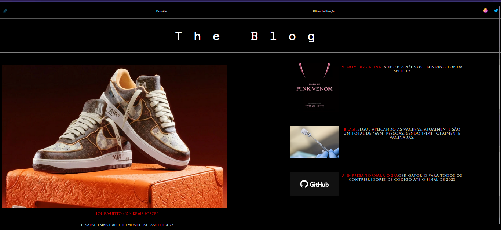

<h2>Pagina Inicial de um Blog Ficticio</h2>

<h3>
 Desenvolvido para estudo de Display : Grid e Flex
</h3

<h3>Tecnologias Utilizadas. </h3>

 
 
 <h3>Futuro para a pagina</h3>
 
 Pretendo adicionar Rotas, tanto no menu, quanto nas publicações. 

 
Adicionar Publicações. 

 
Responsividade para : Mobile  

 
<h3>Não Funciona.<h3/>
  
Menu Superior. 

  
Links das Redes Sociais. 

 
 
 <h3> Imagens </h3>

